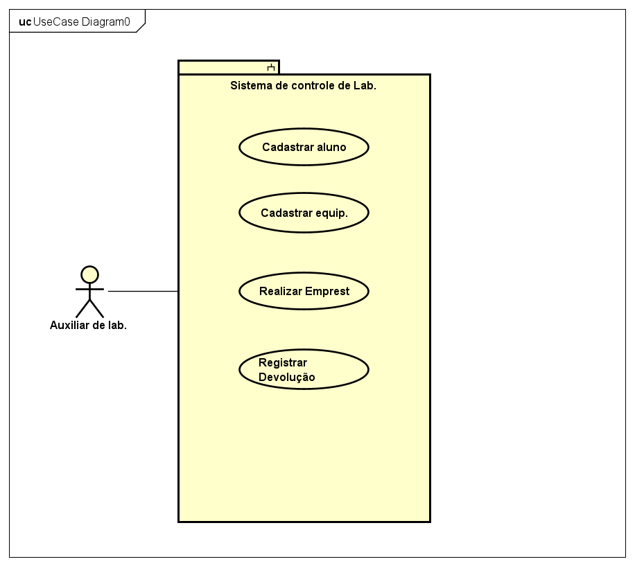
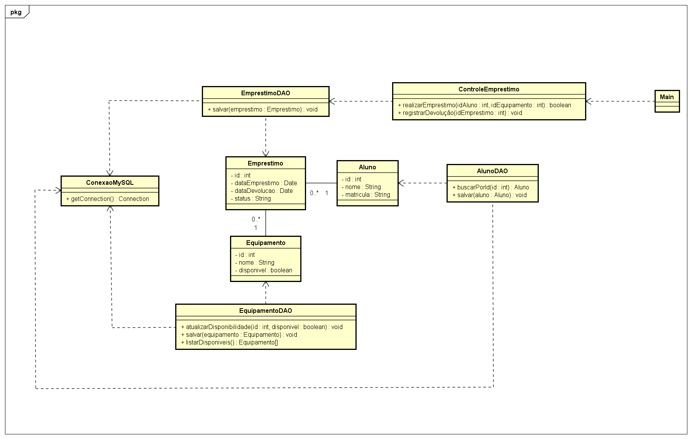
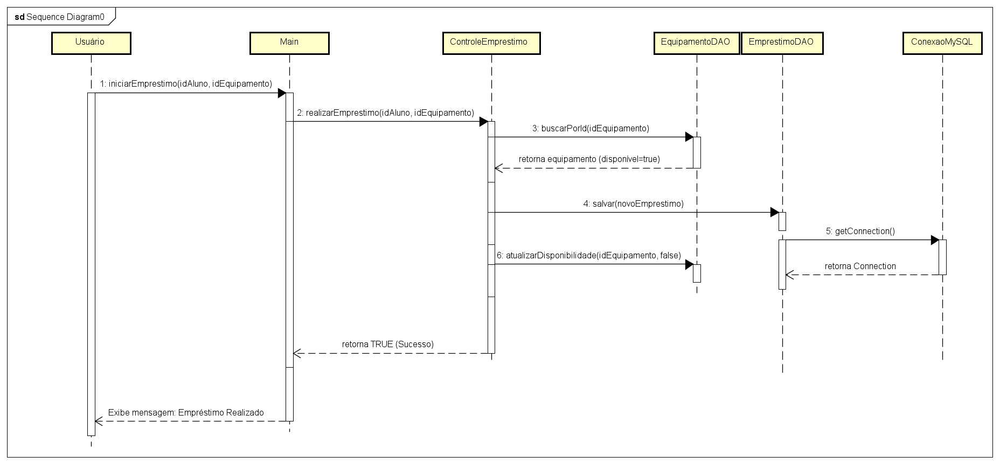
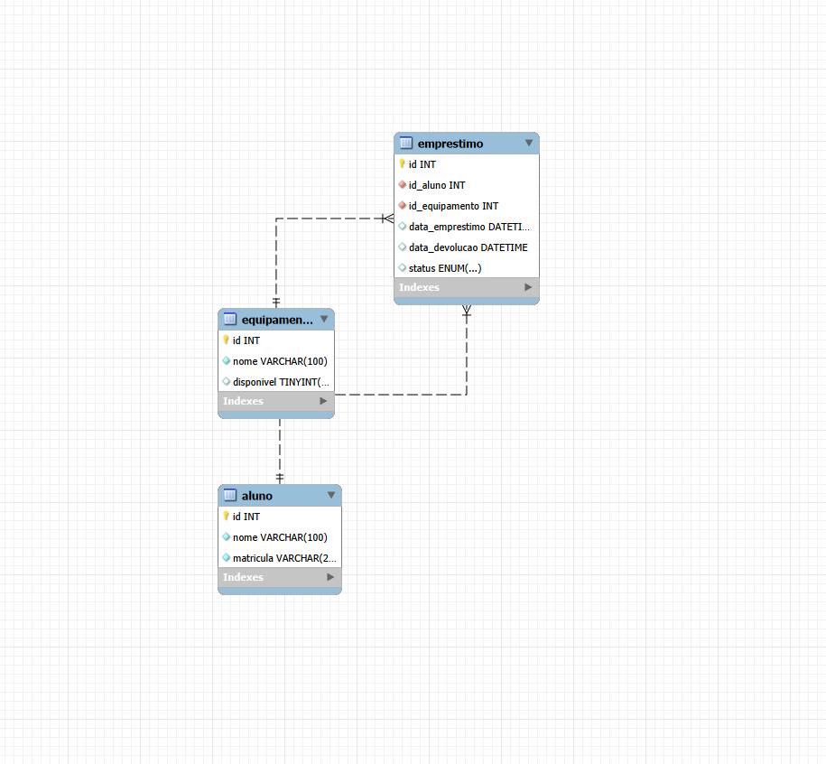

# Sistema de Controle de Empréstimo de Equipamentos

Este projeto consiste em uma solução de software para gerenciar o empréstimo e a devolução de equipamentos em laboratórios acadêmicos, evitando conflitos de agendamento e perda de histórico.

Foi desenvolvido como requisito avaliativo prático de Engenharia de Software no curso de Ciência da Computação do IFPA Campus Tucuruí, integrando modelagem UML, banco de dados relacional e programação Java Orientada a Objetos com interface gráfica (Swing).

## Integrantes
* Hudson Henrique Bogarim Brito

## Requisitos implementados
* Interface Gráfica de Usuário (GUI) para interação segura.
* Impedimento de empréstimo de equipamento indisponível ou inexistente.
* Alteração automática da disponibilidade do equipamento após empréstimo (`disponivel = FALSE`).
* Proteção contra vazamento de conexões no banco de dados (`try-with-resources`).
* Separação de responsabilidades utilizando o Padrão DAO e MVC.

## 📐 Diagramas UML
Os diagramas abaixo foram modelados no Astah e representam o escopo arquitetural do sistema:

### Diagrama de Casos de Uso
Mapeamento das interações do Auxiliar de Laboratório com o sistema.


### Diagrama de Classes
Estrutura de Entidades (Model), DAOs e Controle.


### Diagrama de Sequência
Fluxo temporal e validação da regra de negócio de um empréstimo válido.


## Modelo do Banco de Dados e Script SQL
O banco de dados `controle_laboratorio` foi modelado e implementado no MySQL.



### Como criar o banco MySQL
1. Abra o MySQL Workbench ou phpMyAdmin.
2. Execute o arquivo `script_banco.sql` (fornecido na raiz deste repositório) para criar as tabelas `aluno`, `equipamento` e `emprestimo`.
3. O script já insere dados iniciais reais para testes.

## Como executar o projeto Java
1. Clone este repositório: `git clone https://github.com/seu-usuario/seu-repositorio.git`
2. Abra o projeto na sua IDE (IntelliJ, Eclipse, etc.).
3. Adicione o **MySQL Connector/J** (`.jar`) nas bibliotecas (Libraries) do projeto.
4. Crie um arquivo `db.properties` na raiz do projeto com as suas credenciais locais:
   ```properties
   db.url=jdbc:mysql://localhost:3306/controle_laboratorio
   db.user=seu_usuario
   db.password=sua_senha